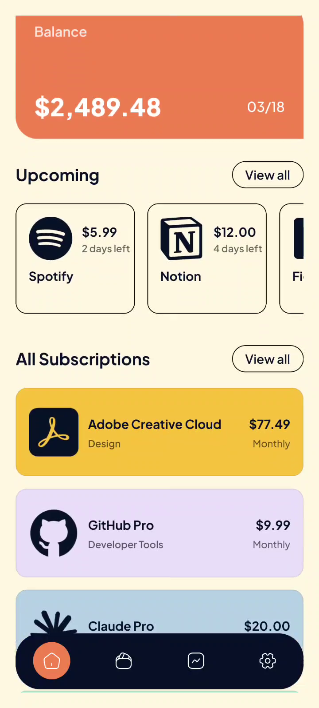
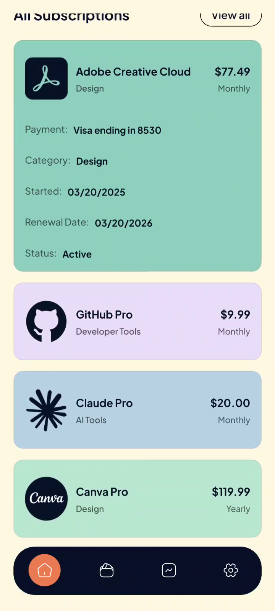
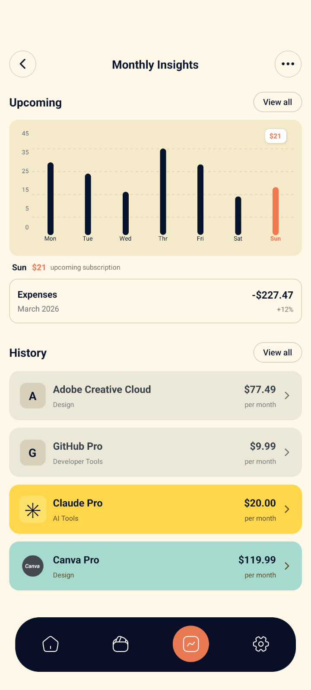
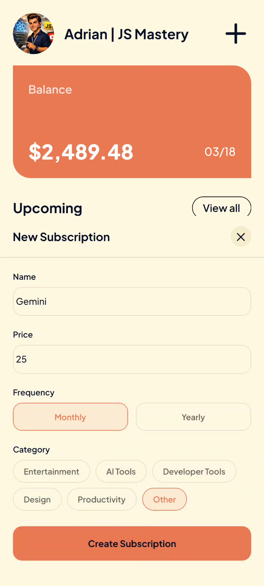

# Recurly — Subscription Tracker

A modern mobile subscription-management app designed to make recurring expenses easier to understand, monitor, and manage.

## ✨ Overview

Recurly brings recurring subscriptions into one clean dashboard. Users can quickly see their current balance, upcoming charges, active subscriptions, and spending insights without having to dig through multiple apps or statements.

## 🚀 Highlights

- **Dashboard** — View balance and upcoming subscription charges at a glance.
- **Subscription management** — Browse active subscriptions with price, billing frequency, category, start date, renewal date, and status.
- **Search** — Quickly filter the subscription list.
- **Monthly insights** — Visualize upcoming recurring expenses and review subscription history.
- **Add subscription** — Create a subscription with name, price, billing frequency, and category.
- **Clean mobile UI** — Card-based layout, clear hierarchy, rounded components, and a consistent visual system.
- **Bottom navigation** — Fast access to the main areas of the app.

## 📱 Screenshots

### Home Dashboard


### Subscriptions


### Monthly Insights


### Add Subscription


## 🎥 Demo

**Portfolio demo:** `recurly-portfolio-demo.mp4`

Suggested showcase flow:

`Dashboard → Subscriptions → Monthly Insights → Add Subscription`

## 🧩 Core User Flow

1. Open Recurly and review the current balance.
2. Check upcoming recurring payments.
3. Browse all subscriptions and search the list.
4. Open Monthly Insights to understand upcoming expenses and history.
5. Add a new subscription with its price, frequency, and category.

## 🛠️ Tech Stack

| Category               | Technology used                                               |
| ---------------------- | ------------------------------------------------------------- |
| **Frontend / Mobile**  | **React Native**                                              |
| **Framework**          | **Expo**                                                      |
| **Language**           | **JavaScript / JSX**                                          |
| **Styling**            | **NativeWind v5** (Tailwind CSS)                              |
| **Navigation**         | **Expo Router**                                               |
| **State management**   | **React state/hooks** for the course project; **not Zustand** |
| **Authentication**     | **Clerk**                                                     |
| **Analytics**          | **PostHog**                                                   |
| **Backend**            | **Node.js + Express**                                         |
| **Database / Storage** | **MongoDB**                                                   |
| **Build & deployment** | **Expo EAS**                                                  |

## 📂 Project Structure

```text
Recurly/
├── README.md
├── screenshots/
│   ├── 01-home-dashboard.png
│   ├── 02-subscriptions.png
│   ├── 03-monthly-insights.png
│   └── 04-add-subscription.png
└── ...
```

## ⚙️ Installation

```bash
# Clone the repository
git clone https://github.com/Medha030/Recurly-subscription-tracker.git

# Open the project
cd Recurly

# Install dependencies
npm install

# Start / run the app
npx expo start
```

## 📦 APK / Demo

- **APK:** `https://expo.dev/accounts/medha_03/projects/React_Native-Recurly/builds/2e100482-5f8e-4174-9a0d-7359c9bf526e`
- **Demo video:** `recurly-portfolio-demo.mp4`
- **Repository:** `https://github.com/Medha030/Recurly-subscription-tracker.git`

## 🎯 Project Focus

This project focuses on building a practical personal-finance experience with:

- clear information hierarchy
- intuitive subscription management
- useful spending visualization
- responsive mobile interactions
- a polished, portfolio-friendly UI

## 📌 Future Improvements

- Push notifications before renewal dates
- Automatic subscription detection
- Cloud sync across devices
- Authentication and user profiles
- Exportable spending reports
- Budget limits and spending alerts
- Dark mode
- Real payment/billing integrations

## 👤 Author

**[G.V.MEDHA SREE]**

- GitHub: `https://github.com/Medha030`
- LinkedIn: `www.linkedin.com/in/gv-medha-sree-15918a350`
- Portfolio: `<YOUR_PORTFOLIO_URL>`

---

⭐ If you find Recurly useful, consider starring the repository.
